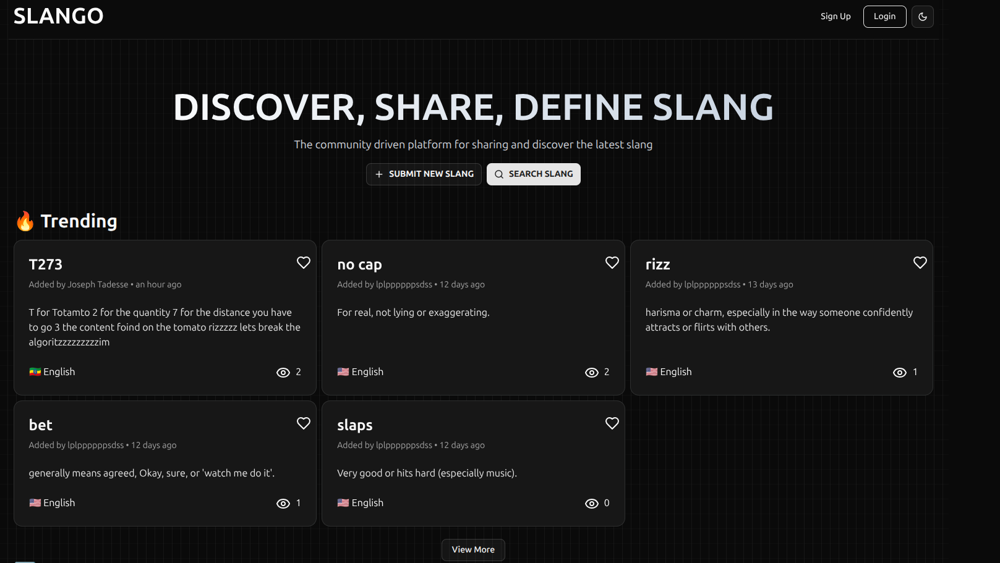

# Slango



Slango is a modern web application that lets users share and explore unique slang words and phrases. Create an account, log in, and contribute to a growing collection of slang—all within a sleek, responsive interface.

## Features

- **User Authentication**: Sign up and log in functionality with form validation.
- **Responsive Design**: Fully responsive layout for desktop and mobile devices.
- **Dark Mode**: Toggle between light and dark modes for a personalized experience.
- **Dynamic Navigation**: Mobile-friendly navigation with animations.
- **Social Login**: Easy login with third-party providers.
- **Form Validation**: Built-in validation for user inputs using `zod` and `react-hook-form`.

## Tech Stack

- **Frontend**: React, Next.js, TypeScript
- **Styling**: Tailwind CSS
- **Form Handling**: `react-hook-form` with `zod` for schema validation
- **Animations**: Framer Motion
- **Icons**: Lucide React
- **Routing**: Next.js routing system
- **Authentication**: BetterAuth for secure authentication and social logins
- **Database**: Mongodb with Prisma ORM
- **API**: RESTful API routes with Next.js
- **State Management**: Zustand
- **Deployment**: Vercel
- **Linting & Formatting**: ESLint, Prettier

---

## 🚀 Get Started

1. Clone the repo:  
    ```bash
    git clone https://github.com/yourusername/slango.git
    ```
2. Install dependencies:  
    ```bash
    npm install
    ```
3. Set up environment variables (see `.env.example`).
4. Run the development server:  
    ```bash
    npm run dev
    ```

---

## 🤝 Contributing

Contributions are welcome! Please open issues or submit pull requests to help improve Slango.

---

## 📄 License

This project is licensed under the MIT License.

